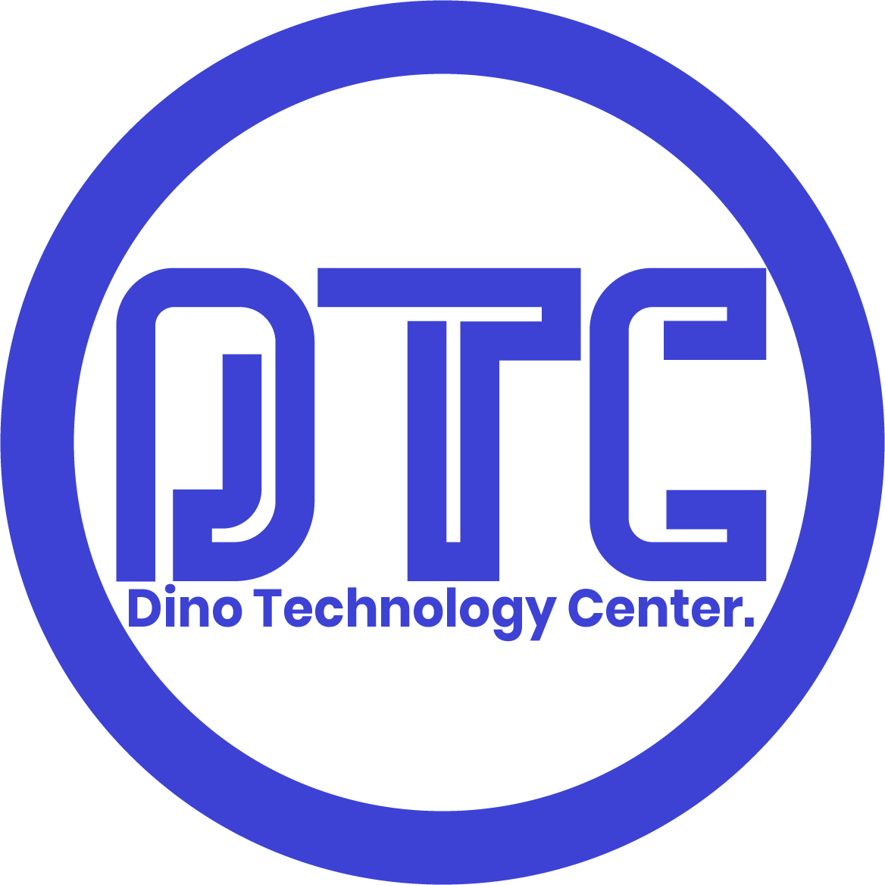

<h1 align="center">
  DinoTechnology Center (DTC)
</h1>

Building innovative software solutions and empowering businesses through modern technology.

  
  
  
  

---

# 🌍 About DinoTechnology Center

**DinoTechnology Center (DTC)** is a technology innovation hub focused on building scalable digital solutions, AI-powered systems, and enterprise software.

We aim to deliver **modern, reliable, and secure technology solutions** for businesses, startups, and organizations.

---

# 🚀 Focus Areas

| Area | Description |
|-----|-------------|
| 💻 Web & Mobile Development | Modern responsive websites and mobile applications |
| 🎨 Graphics & Creative Design | UI/UX design, branding, and digital creativity |
| ☁️ Software & SaaS Solutions | Enterprise systems and cloud-based platforms |
| 🔐 Cybersecurity & Data Protection | Secure infrastructure and digital security |

---

# 🧠 Technology Stack

## 🎨 Frontend Development

## ⚙️ Backend Development

## 🗄️ Databases

## 🤖 AI & Machine Learning

---

# 🔬 Future & Research Fields

## 🌐 Internet of Things (IoT)

## 🤖 Robotics

---

# 👥 Team Members

| Name | Role |
|-----|------|
| Founder | Lead Software Engineer & System Architect |
| Backend Developer | API Development & Database Systems |
| Frontend Developer | Web Applications & UI/UX |
| Creative Designer | Graphics & Product Design |

---

# 📊 Organization Stats

---

# 💻 Featured Projects

| Project | Description |
|-------|-------------|
| **Omega Health** | Health monitoring system for heart rate & blood pressure |
| **Contract Management System** | Enterprise system for managing contracts |
| **AI Crop Detection** | Computer vision system for crop identification |
| **E-Commerce Platform** | Full-featured online shopping system |

---

# 🤝 Contributing

We welcome developers, designers, and innovators to collaborate with us.

### Steps to Contribute

1. Fork a repository  
2. Create a feature branch  
3. Commit your changes  
4. Submit a Pull Request  

---

# 🧑‍💻 Join Our Community

We encourage collaboration and innovation.

You can contribute by:

- Developing open-source tools  
- Reporting issues  
- Improving documentation  
- Creating new features  

---

# 📫 Contact

Website: **Coming Soon**  
Email: **info@dinotechnologycenter.com**

---

# ⭐ Support

If you like our work, consider **starring our repositories** and following the organization.

Together we build the future of technology 🚀

